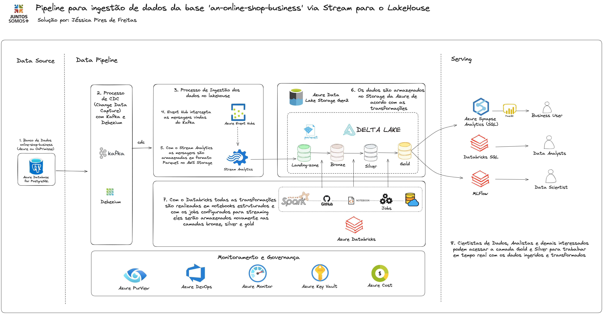
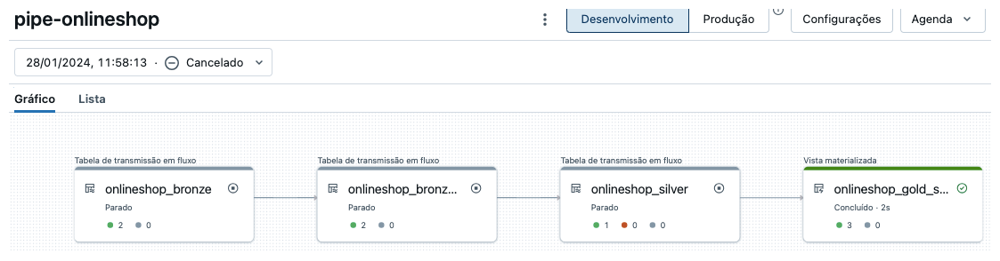

# data-pipeline-stream-postgresql

Proposta de criação de uma arquitetura de dados com ingestão stream de banco de dados PostgresSQL com Azure e Databricks e utilização do Kafka e Debezium para CDC.

<h2>Arquitetura</h2>

A arquitetura contempla uma solução de completa, ponta a ponta, com ingestão, transformação e disponibilização de dados advindos de um banco de dados PostgreSQL. Seguindo o desenho proposto:

<h2>Data Source</h2>
Considerando que usaremos um banco PosgresSQL para lidar com os dados da fonte (https://www.kaggle.com/datasets/gabrielramos87/an-online-shop-business/data) temos a seguinte estrutura de dados que precisaremos lidar:

* Banco de dados: business
* Tabela: onlineshop

O banco deve permitir replicação lógica para que seja possível seguir com a replicação stream no Kafka. 

<h2>Data Pipeline</h2>

<h3>1. Ingestão</h3>
Definimos que a ingestão será realizada via Kafka + Debezium. O uso conjunto do Apache Kafka e do Debezium oferece uma solução robusta e escalável para a captura de mudanças de dados em tempo real (CDC) em sistemas de banco de dados. Kafka atua como uma plataforma de streaming distribuída, capaz de lidar com grandes volumes de dados, garantindo alta disponibilidade e tolerância a falhas. Ele permite a transmissão de dados entre diferentes sistemas e aplicações de forma confiável e eficiente. Já o Debezium é um projeto de CDC que se integra aos sistemas de bancos de dados, capturando e enviando cada alteração de dados (como inserções, atualizações e exclusões) para um tópico Kafka. Esta combinação possibilita a construção de arquiteturas de dados reativas e orientadas a eventos, onde as mudanças nos dados são propagadas em tempo real através de um ecossistema de sistemas, permitindo uma ampla gama de aplicações, desde análises em tempo real até a sincronização entre diferentes bancos de dados e sistemas de processamento de dados.

No repositório podemos encontrar um exemplo de configuração dessas duas ferramentas para o PostgreSQL. 

## Kafka
 * [2-kafka](./01-onlineshop/1-data-pipeline/2-kafka) 
   * [docker-compose.yaml](./01-onlineshop/1-data-pipeline/2-kafka/docker-compose.yaml)
   * [connector.json](./01-onlineshop/1-data-pipeline/2-kafka/connector.json)
  
Um exemplo de arquivo json gerado pelo Debezium de ingestão de novos registros na base pode ser verificado aqui: (./01-onlineshop/0-resources/cdc-json-file-sample)
     

Para funcionamento do CDC, precisaremos configurar no Azure Event Hub um workspace para essa solução. Com os dados chegando em nossos tópicos no Event Hub (que serão criados automaticamente com o Kafka, através das configurações passadas no código) poderemos criar no Azure Stream Analytics um trabalho onde a entrada são os eventos do hub e a saída é a escrita desses arquivos de alterações no Azure DataLake Storage Gen2 em formato Parquet no Container "landing-zone". Com isso teremos implementado nossa camada raw em nosso lakehouse. 

Observações:

* O Debezium irá criar um slot de replicação dentro do postgres chamado "debezium", mas você pode configurar através do parametro "slot.name" do conector.
* Serão gerados 3 hubs/topicos dentro do Event Hubs respectivamente chamados de postgres-dev-configs, postgres-dev-offsets e postgres-dev-status. Eles podem ser configurados dentro do docker-compose alterando as váriaveis: CONFIG_STORAGE_TOPIC, OFFSET_STORAGE_TOPIC, STATUS_STORAGE_TOPIC.
* Esses topicos serão usados pelo Debezium para controlar o estado dos conectores cadastrados e o ponto em que a leitura foi realizada até o momento: offset.

<h3>2. Transformações</h3>
Com os dados disponíveis em landing-zone, usaremos o Databricks para realizar as transformações para as camadas bronze, prata e ouro. Para isso, teremos a seguinte estrutura dentro do workspace do Databricks:

 * [1-databricks](./01-onlineshop/1-data-pipeline/1-databricks)
      * [0-setup](./01-onlineshop/1-data-pipeline/1-databricks/0-setup)
        * [1-mount-ADLS.ipynb](./01-onlineshop/1-data-pipeline/1-databricks/0-setup/1-mount-ADLS.ipynb)
      * [1-transformation](./01-onlineshop/1-data-pipeline/1-databricks/1-transformation)
        * [1-onlineshop-dlt-cdc-sql.sql](./01-onlineshop/1-data-pipeline/1-databricks/1-transformation/1-onlineshop-dlt-cdc-sql.sql)
          

Os notebooks dentro de setup remetem as configurações iniciais para a criação da estrutura para funcionamento entre Databricks e Azure, como criação das conexões e montagem do ADLS. Para que isso seja possível e funcione será necessário criar um Registro de Aplicativo na Azure, pois as credenciais serão necessárias para montar o ADLS.

O arquivo [1-onlineshop-dlt-cdc-sql.sql](./01-onlineshop/1-data-pipeline/1-databricks/1-transformation/1-onlineshop-dlt-cdc-sql.sql) é responsável pelo pipeline, onde teremos um modelo de código que lê dados em stream do bucket onde os dados de CDC serão entregues e a partir disso ele fará a transformação para as camadas Bronze, Silver e Gold.

No Databricks o Workflow final terá a seguinte estrutura:

